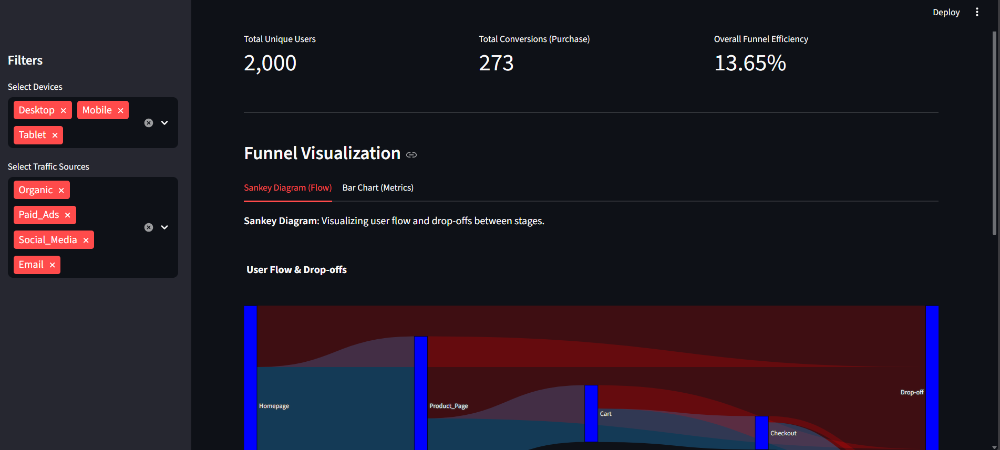
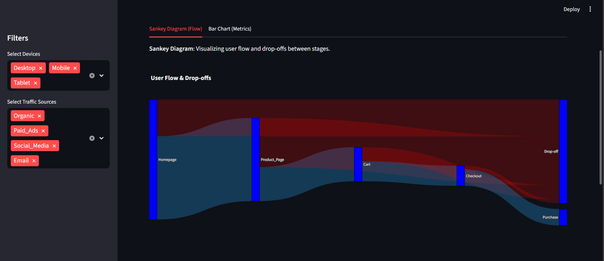
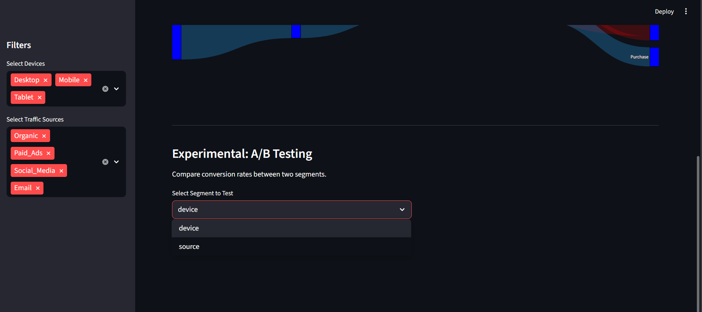
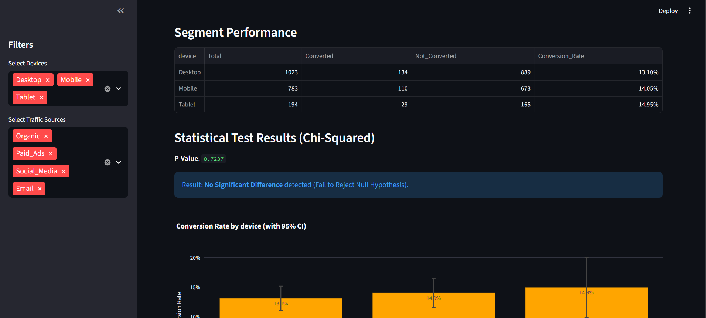
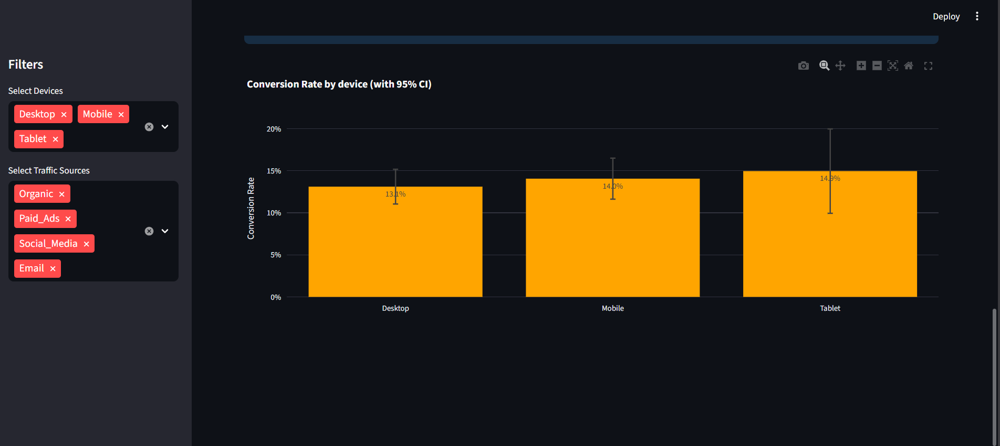
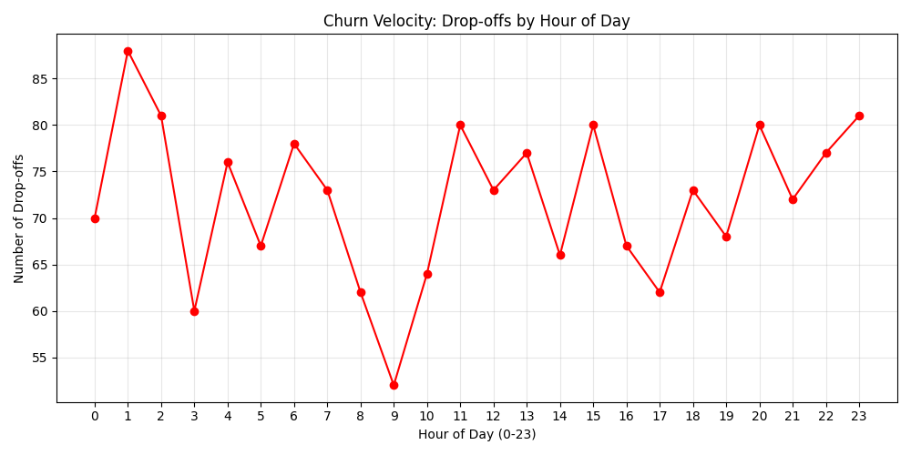

# User Funnel & Drop-off Analysis

This project performs a multi-stage funnel analysis on user journey data to calculate conversion and drop-off rates. It segments users by device and traffic source to identify key behavior patterns.

## Features
- **Synthetic Data Generation**: Creates realistic user journey data.
- **Funnel Analysis**: Calculates conversion rates between stages (Homepage -> Product -> Cart -> Checkout -> Purchase).
- **Segmentation**: Analyzes funnel performance by Device (Desktop, Mobile, Tablet) and Traffic Source.
- **Visualization**: Generates charts to visualize the funnel and drop-off points.

## Usage

1. **Install Dependencies**:
   ```bash
   pip install -r requirements.txt
   ```

2. **Generate Data**:
   ```bash
   python generate_data.py
   ```
   This will create `user_funnel_data.csv`.

3. **Run Analysis**:
   ```bash
   python analysis.py user_funnel_data.csv
   ```
   This will output the analysis results and save validation charts.

## Files
- `generate_data.py`: Script to generate synthetic data.
- `analysis.py`: Main analysis script.
- `user_funnel_data.csv`: Generated dataset.








